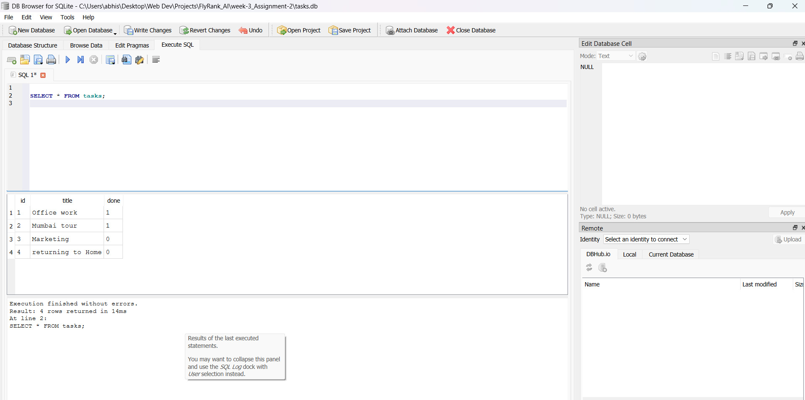

# 📋 Task Management API with SQLite

A simple CRUD (Create, Read, Update, Delete) REST API built using **FastAPI** and **SQLite** as part of the **FlyRank AI Backend Internship – Week 3 Assignment**.

The project demonstrates how to migrate an in-memory task management API to a persistent SQLite database while maintaining complete CRUD functionality.

---

## 🚀 Features

- ✅ FastAPI REST API
- ✅ SQLite database integration
- ✅ Create, Read, Update & Delete tasks
- ✅ Automatic database creation
- ✅ Automatic sample data seeding
- ✅ Interactive Swagger UI documentation
- ✅ Parameterized SQL queries for safety

---

## 🛠️ Tech Stack

- Python 3.x
- FastAPI
- Uvicorn
- SQLite3

---

## 📁 Project Structure

```text
week-3_Assignment-2/
│── main.py
│── tasks.db (Generated automatically)
│── requirements.txt
│── README.md
```

---

## ▶️ Installation

### 1. Clone the repository

```bash
git clone <YOUR_GITHUB_REPOSITORY_URL>
```

### 2. Navigate to the project folder

```bash
cd FlyRank_AI/week-3_Assignment-2
```

### 3. Create a virtual environment

```bash
python -m venv venv
```

### 4. Activate the virtual environment

**Windows**

```bash
venv\Scripts\activate
```

**Linux / macOS**

```bash
source venv/bin/activate
```

### 5. Install dependencies

```bash
pip install -r requirements.txt
```

---

## ▶️ Run the Project

```bash
uvicorn main:app --reload
```

Open your browser:

```
http://127.0.0.1:8000/docs
```

---

# 🗄️ Why SQLite?

SQLite is a lightweight, serverless relational database that stores all data inside a single local database file (`tasks.db`). It requires no separate database server, making it an excellent choice for learning database-backed APIs and building small to medium-sized applications.

Advantages:

- Lightweight
- Easy to configure
- No installation required
- Persistent storage
- Fast and reliable

---

# ⚙️ Automatic Database Creation

The application automatically creates **tasks.db** when it is run for the first time.

If the database is empty, three sample tasks are automatically inserted into the database.

Therefore, users only need to run the application—no manual database setup is required.

---

# 📌 API Endpoints

| Method | Endpoint | Description |
|---------|----------|-------------|
| GET | `/` | Root endpoint |
| GET | `/health` | Health check |
| GET | `/tasks` | Get all tasks |
| GET | `/tasks/{id}` | Get task by ID |
| POST | `/tasks` | Create a task |
| PUT | `/tasks/{id}` | Update a task |
| DELETE | `/tasks/{id}` | Delete a task |

---

# 🧾 Sample SQL Query

```sql
SELECT * FROM tasks;
```

### Output

Returns all the task records currently stored in the SQLite database.

---

# 📷 Project Screenshots

## Swagger UI


---

## SQLite Database (DB Browser)



---

# 📚 Learning Outcome

Through this assignment, I learned:

- FastAPI CRUD development
- SQLite database integration
- SQL queries using Python
- Database persistence
- Parameterized SQL statements
- API testing using Swagger UI

---

# 👨‍💻 Author

**Abhisek Panda**

B.Tech – CSE (AI & ML)

Odisha University of Technology and Research (OUTR), Bhubaneswar

Backend AI Engineering Intern – FlyRank AI
